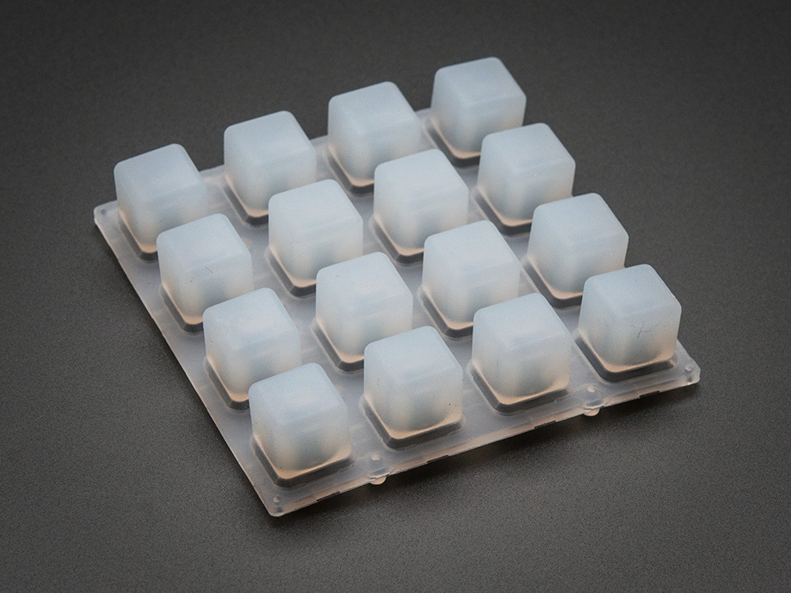

# Adafruit Trellis PCB 

This is a library for the Adafruit Trellis PCB

Pick one up today in the adafruit shop!
  * https://www.adafruit.com/products/1611
  * https://www.adafruit.com/product/1616

These tiles use I2C to communicate, 2 pins are required to interface.

Adafruit invests time and resources providing this open source code, please support Adafruit and open-source hardware by purchasing products from Adafruit!

Written by Limor Fried/Ladyada  for Adafruit Industries. BSD license, check license.txt for more information. 

All text above must be included in any redistribution
